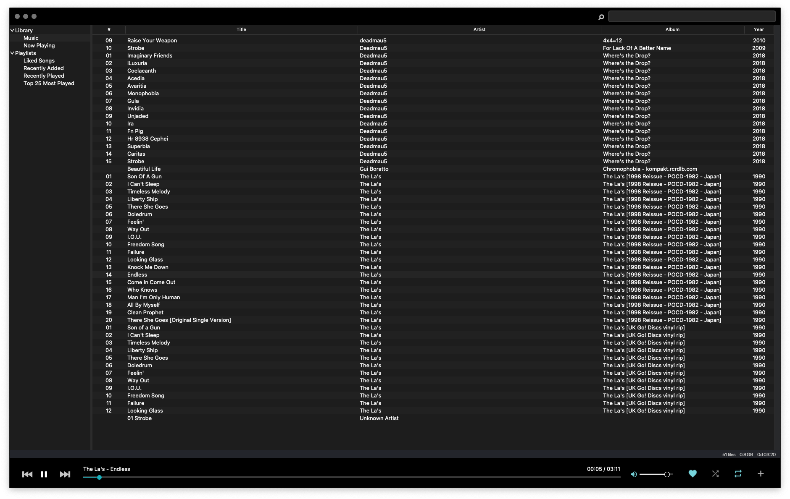

# mt

`mt` is a simple desktop music player designed for large music collections.



## Minimum Requirements

* macOS/Linux
* [Python 3.11+](https://www.python.org/downloads/release/python-31111/)
* [tcl-tk](https://formulae.brew.sh/formula/tcl-tk)
* [VLC](https://www.videolan.org/vlc/index.html)
* [uv](https://github.com/astral-sh/uv)

## Setup

```bash
# install tcl-tk
brew install tcl-tk

# install vlc
## macos
brew install --cask vlc

## TODO: qa ubuntu/wsl
## linux

# install uv
curl -LsSf https://astral.sh/uv/install.sh | sh

# create virtual environment
uv venv --python ">=3.11,<3.12"

# install dependencies
uv pip install -r pyproject.toml --all-extras

# run the app
uv run main.py
```

## Usage

> [!WARNING]
> This app is currently pre-alpha and is not yet a good daily driver for playing music you don't mind getting sucked into a black hole.
> 
> THERE BE DRAGONS
> 
> With that said, with the 1.0.0 release candidate, a proper signed build will be added and this message will be removed.
>
> For meow, you'll have to build the app per the [dev](#run-the-app) section 👌

## Development

### Auto-Reload Utility

The `repeater` script provides automatic reloading for Tkinter applications during development, extending tkreload functionality to watch multiple files and directories simultaneously.

#### Installation

```bash
uv sync --all-extras  # Install all dependencies including watchdog
```

#### Run the app

```bash
# Watch main.py and default directories (core/, utils/)
uv run python repeater

# Watch a specific main file
uv run python repeater main.py
```

#### Watched Paths

By default, watches:

* **Main file**: `main.py` (or specified file)
* **core/**: Business logic directory (recursive)
* **utils/**: Utilities directory (recursive)

#### Runtime Commands

* **`h`**: Show help and current status
* **`r`**: Manual restart of the application
* **`a`**: Toggle auto-reload on/off
* **`Ctrl+C`**: Exit the application gracefully

#### Features

* Multi-directory watching
* Content-aware reloading (only when content changes)
* Rich console output with progress indicators
* Cross-platform support (Windows, macOS, Linux)

<!-- TODO: install -->

## TODO

See [TODO.md](TODO.md) for a list of features and improvements.
