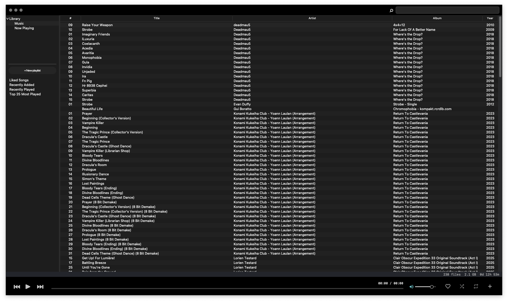
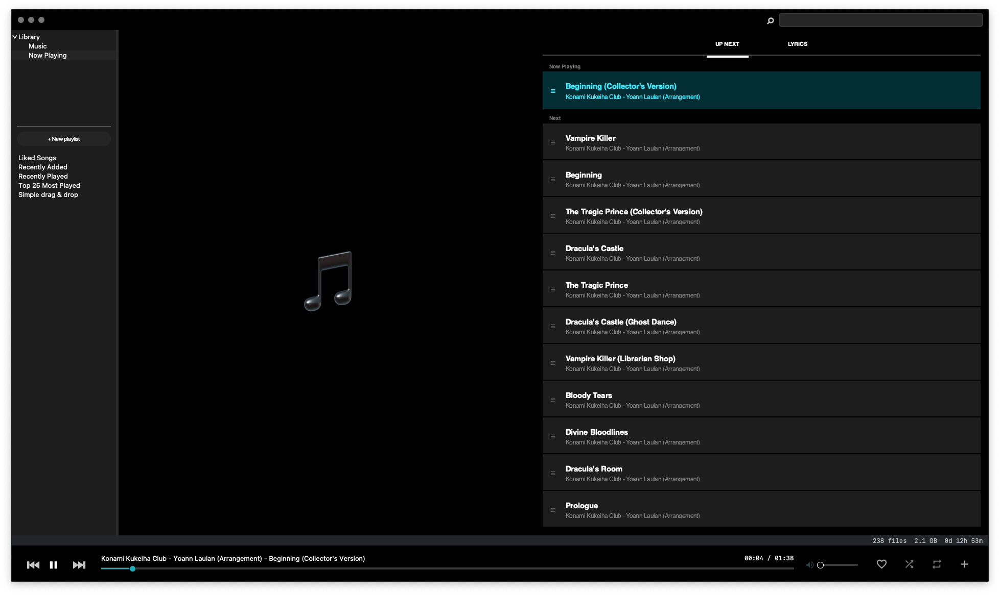
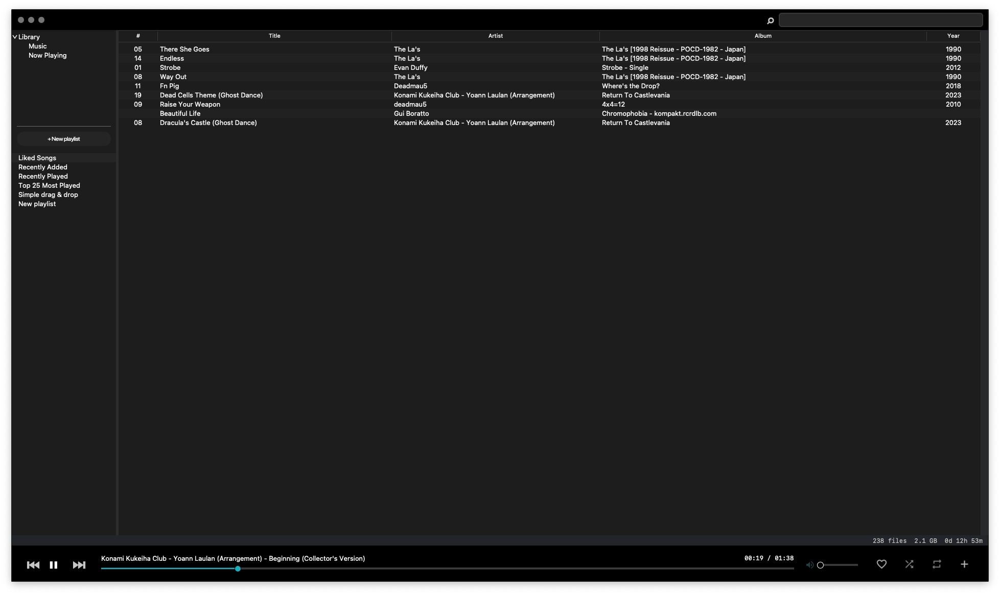
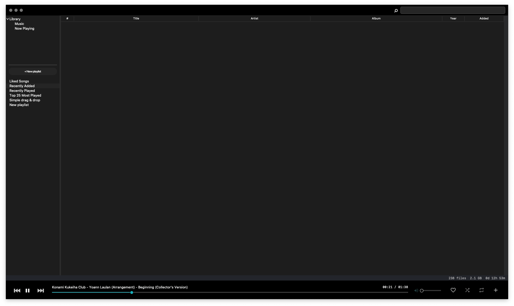
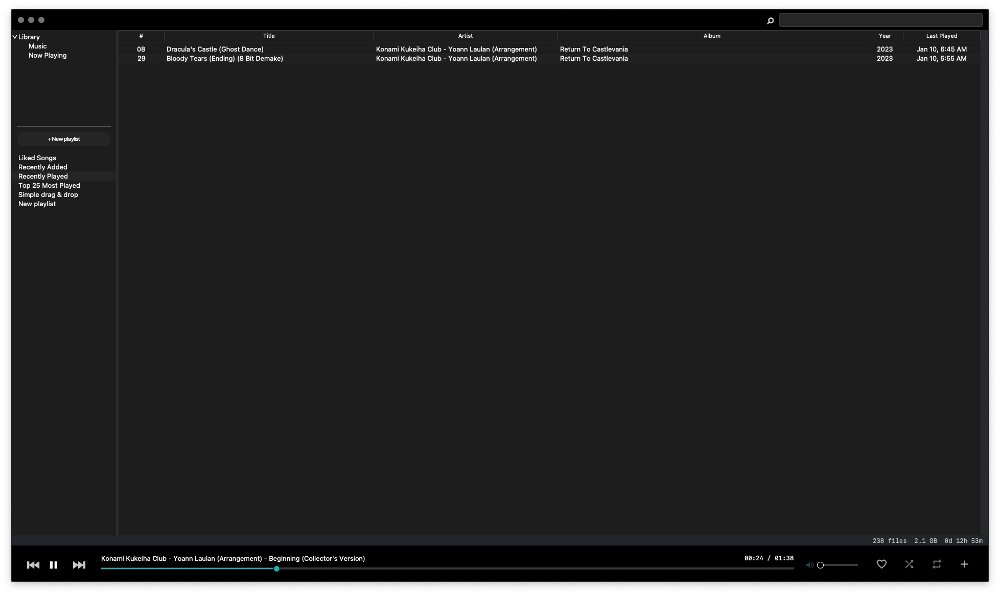
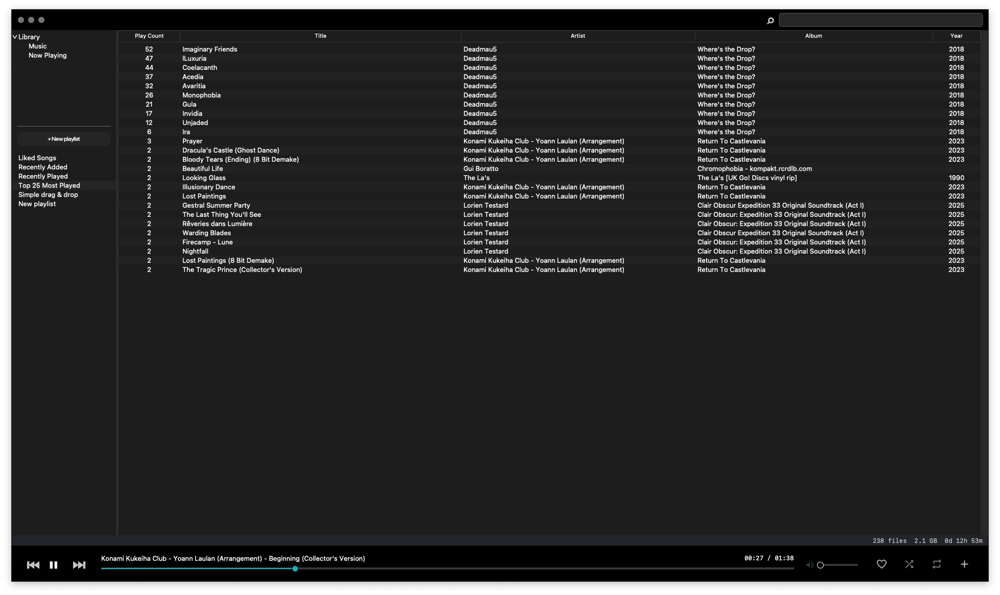
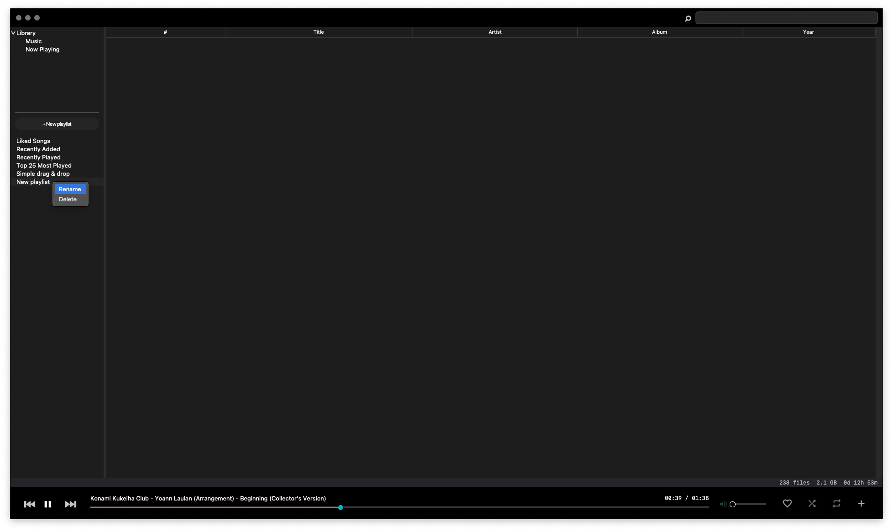

# Python Architecture

## Overview

The MT music player is built using a modular Python architecture centered around the `core/` package, with clear separation of concerns between data management, user interface, audio playback, and system integration.

## Core Architecture

### Entry Point (`main.py`)

The application entry point follows a structured initialization sequence:

1. **Logging Setup** - Eliot-based structured logging initialization
2. **Window Creation** - TkinterDnD-enabled root window with icon setup
3. **Theme Application** - Style configuration before component creation
4. **Player Instantiation** - Main `MusicPlayer` class initialization
5. **Component Setup** - All subsystem initialization and connection
6. **Event Loop** - Tkinter main loop with error handling

### Central Orchestrator (`core/player/`)

The `core/player/` package contains the `MusicPlayer` class and its composed managers, serving as the central orchestrator. The package uses a **manager composition pattern** to separate concerns:

#### Package Structure

```
core/player/
├── __init__.py      # MusicPlayer class - main orchestrator
├── handlers.py      # PlayerEventHandlers - event callbacks
├── library.py       # PlayerLibraryManager - library operations
├── progress.py      # PlayerProgressController - playback progress
├── queue.py         # PlayerQueueHandler - queue operations
├── ui.py            # PlayerUIManager - UI component management
└── window.py        # PlayerWindowManager - window lifecycle
```

#### Manager Composition Pattern

The `MusicPlayer` class composes specialized manager classes, each handling a specific domain:

```python
# Manager classes composed into MusicPlayer
PlayerWindowManager    # Window size, position, macOS styling
PlayerUIManager        # UI component lifecycle and layout
PlayerEventHandlers    # User interactions, media keys, file events
PlayerLibraryManager   # Library scanning, filtering, display
PlayerQueueHandler     # Queue operations and playback order
PlayerProgressController  # Progress tracking and seeking
```

#### Core Subsystems

```python
# Core subsystems initialized in setup_components()
self.db = MusicDatabase(DB_NAME, DB_TABLES)  # SQLite data layer (facade)
self.queue_manager = QueueManager(self.db)    # Queue operations
self.library_manager = LibraryManager(self.db) # Library scanning
self.favorites_manager = FavoritesManager(self.db) # Favorites/likes
self.player_core = PlayerCore()               # VLC audio engine
```

#### UI Component Architecture

```python
# UI components with callback-based communication
self.library_view = LibraryView()         # Left panel library browser
self.queue_view = QueueView()             # Right panel queue display
self.progress_bar = ProgressBar()         # Bottom progress/controls
self.search_bar = SearchBar()             # Library search interface
self.status_bar = StatusBar()             # Status display
```

## Data Layer (`core/db/`)

The `core/db/` package implements a **facade pattern** for database operations, with specialized modules for each domain:

### Package Structure

```
core/db/
├── __init__.py      # Facade exports (MusicDatabase, DB_TABLES)
├── database.py      # MusicDatabase class - core operations
├── library.py       # Library track CRUD operations
├── queue.py         # Queue management operations
├── favorites.py     # Favorites and dynamic playlist views
├── playlists.py     # Custom playlist operations
└── preferences.py   # User preferences persistence
```

### Database Schema

SQLite-based persistence with the following tables:

- **`library`**: Music file metadata and indexing
  - File paths, metadata (artist, album, title, duration)
  - Play count and last played timestamps
  - Added date for "Recently Added" views

- **`queue`**: Current playback queue state
  - Track references by filepath
  - Session persistence across app restarts

- **`favorites`**: Liked tracks
  - Foreign key to library with timestamps
  - Unique constraint prevents duplicates

- **`playlists`** / **`playlist_items`**: Custom playlists
  - Playlist metadata with creation timestamps
  - Ordered track references with position tracking

- **`settings`**: Key-value preference storage
  - Window geometry, volume, loop/shuffle state

- **`lyrics_cache`**: Cached lyrics data
  - Artist/title lookup with source URLs

### Database Operations

The `MusicDatabase` facade provides:

- **Schema Management**: Automatic table creation via `DB_TABLES` dict
- **Query Interface**: High-level operations delegated to domain modules
- **Preference Storage**: JSON-serialized configuration data
- **Transaction Safety**: Atomic operations for data consistency

## Library Management (`core/library.py`)

### Scanning Engine

The `LibraryManager` handles:

- **Directory Traversal**: Configurable depth limits and exclusion patterns
- **Metadata Extraction**: Mutagen-based tag reading with fallbacks
- **Deduplication**: File content hashing to prevent duplicates
- **Incremental Updates**: Modified time tracking for efficient rescans

### Performance Optimizations

- **Zig Integration**: High-performance directory scanning via `src/scan.zig`
- **Batch Operations**: Bulk database insertions for large libraries
- **Background Processing**: Non-blocking UI during scan operations

## Zig Performance Extension (`src/`)

The `src/` directory contains a Zig-based native extension for high-performance file system operations, built using [ziggy-pydust](https://github.com/spiraldb/ziggy-pydust) for Python FFI.

### Module Structure

```
src/
├── build.zig          # Zig build configuration
├── pydust.build.zig   # Pydust integration
└── scan.zig           # Music directory scanner
```

### scan.zig - Directory Scanner

High-performance recursive directory scanner for audio files:

```zig
// Exposed to Python
pub fn scan_music_directory(args: struct { root_path: []const u8 }) u64
```

**Features:**
- **Audio Detection**: Recognizes `.mp3`, `.flac`, `.m4a`, `.ogg`, `.wav`, `.wma`, `.aac`, `.opus`, `.m4p`, `.mp4`
- **Recursive Walking**: Uses `std.fs.Dir.walk()` for efficient traversal
- **Smart Filtering**: Skips hidden directories, `__pycache__`, `.DS_Store`
- **Memory Safety**: Uses Zig's `GeneralPurposeAllocator` with leak detection

### Build Process

```bash
# Build via Python script
uv run python build.py

# Or via hatch during package installation
hatch build

# Output: core/_scan.so (Python extension)
```

### Python Integration

```python
# Import the Zig extension
from core._scan import scan_music_directory

# Count audio files in directory
count = scan_music_directory("/path/to/music")
```

### Why Zig?

- **Performance**: 10-100x faster than pure Python for large directory trees
- **Memory Efficiency**: Zero-copy string handling, no GC pressure
- **Safety**: Compile-time memory safety without runtime overhead
- **Cross-Platform**: Single codebase for macOS/Linux

## Queue System (`core/queue.py`)

### Queue Management

The `QueueManager` provides:

- **Playback Order**: Linear and shuffle modes with state persistence
- **Dynamic Operations**: Add, remove, reorder queue entries
- **Position Tracking**: Current song index and playback history
- **Loop Modes**: Single track and full queue repeat functionality

### UI Integration

- **Tree View**: Hierarchical display with drag-and-drop support
- **Real-time Updates**: Queue changes reflected immediately in UI
- **Context Actions**: Right-click operations for queue manipulation

## Audio Engine (`core/controls.py`)

### VLC Integration

The `PlayerCore` class wraps VLC functionality:

- **Media Player**: VLC instance management and event handling
- **Playback Control**: Play, pause, stop, seek operations
- **Volume Management**: Audio level control with UI synchronization
- **State Tracking**: Current position, duration, and playback status

### Threading Considerations

- **Background Updates**: Progress tracking in separate thread context
- **Thread Safety**: UI updates via `window.after()` for main thread execution
- **Event Handling**: VLC event callbacks with proper synchronization

## API Server (`api/server.py`)

The `APIServer` class provides programmatic control of the music player via a socket-based JSON protocol, enabling LLM and automation tool integration.

### Architecture

```
┌─────────────────┐     JSON/Socket      ┌─────────────────┐
│  External Tool  │ ◄──────────────────► │   APIServer     │
│  (LLM, Script)  │     localhost:5555   │  (Background)   │
└─────────────────┘                      └────────┬────────┘
                                                  │
                                         window.after()
                                                  │
                                         ┌────────▼────────┐
                                         │   MusicPlayer   │
                                         │  (Main Thread)  │
                                         └─────────────────┘
```

### Threading Model

- **Server Thread**: Daemon thread handles socket connections
- **Client Threads**: Each client request spawns a handler thread
- **Main Thread Execution**: Commands execute via `window.after()` for thread safety
- **Timeout Handling**: 1-second socket timeout for graceful shutdown

### Command Surface

```python
# Playback controls
'play_pause', 'play', 'pause', 'stop', 'next', 'previous'

# Track selection
'select_track', 'play_track_at_index'

# Queue management
'add_to_queue', 'clear_queue', 'remove_from_queue'

# UI navigation
'switch_view', 'select_library_item', 'select_queue_item'

# Slider controls
'set_volume', 'seek', 'seek_to_position'

# Utility controls
'toggle_loop', 'toggle_shuffle', 'toggle_favorite'

# Media key simulation
'media_key'

# Search
'search', 'clear_search'

# Info queries
'get_status', 'get_current_track', 'get_queue', 'get_library'
```

### Configuration

```bash
# Enable API server
MT_API_SERVER_ENABLED=true uv run main.py

# Custom port (default: 5555)
MT_API_SERVER_PORT=5555 uv run main.py
```

### Security

- **Localhost Only**: Binds to `localhost` only, not exposed externally
- **No Authentication**: Designed for local automation, not network access

## User Interface (`core/gui/`)

The `core/gui/` package contains modular UI components built with Tkinter/ttk.

### Package Structure

```
core/gui/
├── __init__.py          # Exports (LibraryView, QueueView, etc.)
├── library_search.py    # LibraryView - left panel browser
├── queue_view.py        # QueueView - right panel queue display
├── player_controls.py   # PlayerControls - transport buttons
├── progress_status.py   # ProgressBar, StatusBar
└── music_player.py      # Legacy stub (deprecated)
```

### Component Structure

- **LibraryView** (`library_search.py`): Left panel with collapsible sections for library views, search, and playlists
- **QueueView** (`queue_view.py`): Right panel tree display with drag-and-drop reordering
- **PlayerControls** (`player_controls.py`): Bottom panel transport controls (play/pause, prev/next, loop, shuffle)
- **ProgressBar** (`progress_status.py`): Custom canvas-based progress indication with click-to-seek

### Theming System (`core/theme.py`)

- **Style Configuration**: ttk.Style-based theming with JSON configuration
- **Platform Integration**: macOS-specific appearance settings
- **Dynamic Updates**: Runtime theme switching capability

## Configuration Management (`config.py`)

### Environment-Based Configuration

Uses `python-decouple` for environment variable integration:

- **Development Settings**: Hot reload, logging levels, debug modes
- **Path Configuration**: Database location, scan directories
- **UI Preferences**: Window size, panel positions, themes
- **Audio Settings**: Format support, output device selection

### Validation and Defaults

- **Input Sanitization**: Configuration value validation and cleanup
- **Fallback Values**: Sensible defaults for missing configuration
- **Type Coercion**: Automatic type conversion for environment variables

## Logging System (`core/logging.py`)

### Structured Logging

Eliot-based logging architecture:

- **Action Tracking**: Hierarchical operation logging with context
- **Error Reporting**: Exception capture with full stack traces
- **Performance Monitoring**: Operation timing and resource usage
- **Debug Support**: Development-time detailed event logging

### Log Categories

- **Application Lifecycle**: Startup, shutdown, component initialization
- **User Actions**: UI interactions, file operations, playback controls
- **System Events**: File system changes, database operations
- **Error Conditions**: Exceptions, validation failures, resource issues

## Platform Integration

### macOS Specific Features

- **Media Key Support**: Native play/pause/next/previous key handling
- **Window Styling**: Document-style windows with dark mode support
- **Drag and Drop**: Native file dropping with TkinterDnD2
- **App Menu Integration**: Standard macOS application menu behavior

### Cross-Platform Considerations

- **Conditional Imports**: Platform-specific feature detection
- **Fallback Behavior**: Graceful degradation on unsupported platforms
- **Path Handling**: Cross-platform file system operations

## Development Tools

### Hot Reload System (`utils/reload.py`)

- **File Watching**: Automatic application restart on code changes
- **Configuration Updates**: Dynamic theme and setting reloads
- **Development Workflow**: Seamless iteration without manual restarts

### Testing Infrastructure

- **pytest Integration**: Comprehensive test suite with fixtures
- **Mock Components**: Isolated testing of individual modules
- **Integration Tests**: End-to-end workflow validation

## Error Handling and Resilience

### Exception Management

- **Graceful Degradation**: Non-critical feature failures don't crash app
- **User Feedback**: Clear error messages for user-actionable issues
- **Recovery Mechanisms**: Automatic retry for transient failures
- **State Cleanup**: Proper resource cleanup on error conditions

### Data Integrity

- **Database Transactions**: Atomic operations prevent corruption
- **File Validation**: Media file integrity checking before operations
- **Backup Strategies**: Configuration and preference preservation
- **Migration Support**: Schema updates without data loss

## Tkinter Implementation (01-11-2026)

Current state of the desktop application UI built with Tkinter/ttk.

### Music Library View


### Now Playing


### Adding Music


### Smart Playlists









### Custom Playlists




### Playback Modes


## Future Architecture Considerations

### Web Migration Readiness

Current architecture decisions supporting future web migration:

- **Separation of Concerns**: Clear API boundaries between components
- **Data Layer Abstraction**: Database operations ready for HTTP API conversion
- **State Management**: Centralized state suitable for client-server architecture
- **Modular Design**: Components can be adapted to web service endpoints
